**[全部文章目录](https://github.com/zhaoweih/Shadowsocks-Tutorial/wiki/%E7%9B%AE%E5%BD%95)**

> 🚀安装成功后如果想加速Shadowsocks的小伙伴可以看看我这篇文章[给小白的kcptun加速shadowsocks教程](./kcptun_shadowsocks_tutorial.md)(效果很明显)
>
> 如果过程中出现问题无法解决可以尝试[备用教程](https://github.com/zhaoweih/Shadowsocks-Tutorial/blob/master/super_easy_shadowsocks_tutorial.md)，或者发送邮件到我邮箱zhaoweihao.dev@gmail.com  或者提[issues](https://github.com/zhaoweih/Shadowsocks-Tutorial/issues)
>
> 如果工程师朋友们需要加速git克隆速度可以查看这篇文章[给小白的git配置shadowsocks代理加速教程](./git/git_shadowsocks_readme.md)

# 前言

为什么要做这个库？因为有句话说“不会翻墙的程序员不是好程序员”，但是某些原因，翻墙可是越来越难了，我之前是用某灯，但是自从上个月开始某灯也不稳定了；我还以为可以和某灯相宿相飞一段时间的，后来就投靠了Shadowsocks了，为什么会选择Shadowsocks呢，因为可以自己搭建服务器，不再受牵制，而且由于是个人服务器被封IP的几率也不会很大；当然你也可以和自己信任的人共享使用，但是Shadowsocks的教程网络上真是参次不齐，很容易误导那些只想翻墙而不是要了解它原理的人，所以我就蹦出个想法：做个几乎是一键式的傻瓜Shadowsocks（以下简称ss）搭建教程给小白们，让大家都能共享自由的互联网。

# 开始

## 购买VPS服务器

俗话说，万事起头难。想想倒也是这样，也不是说购买VPS服务器有多难，是接受它比较难，我当时也是一个还没买过服务器的小白，对于第一次尝试的东西都没有底，怎么敢随意下手。好了，你现在可以放心了，据我使用，Vultr和DigitalOcean这两个服务商都是可以随时部署随时摧毁服务器，是按每小时计费的，一个月是5美金，大概0.007美金一小时，就算你创建一个服务器IP刚好是被某墙屏蔽了，那就删掉也只是扣0.1美金，作为一个穷学生的我都能接受了，你还犹豫吗？

### 1、注册并登录

Vultr推荐链接：https://www.vultr.com/?ref=7370522

这里我比较推荐Vultr，为什么呢？因为他有日本服务器，延迟低，掉包也低； 注册登录后先充值5美金，用paypal绑定国内银行卡可以最低充值5美金，当然也有支付宝，支付宝要最低10美金。

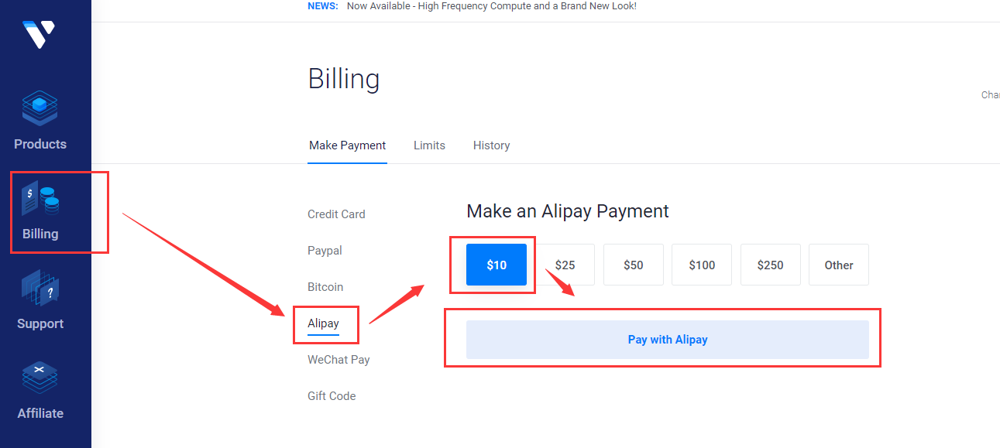

### 2、部署服务器

第一步：在个人页面点击Products然后再点右面的➕号按钮添加一个服务器


第二步：在打开的页面选择德国Frankfurt服务器 (由于日本服务器滥用导致很多IP被封了，可以选择欧洲服务器，例如法国、德国等) ，如果喜欢其他服务器也可以选择，后续操作是一样一样的


第三步：接下来要注意了，系统最好选择Debian 10 x64，点击Debian可以下拉选择10 x64


第四步：选择套餐，当然ss不需要配置太高的服务器，最低配置5美金一个月的就可以了，反正我每次看2.5美金都是卖光的，如果你能看到那赶紧选啊，千年一遇。

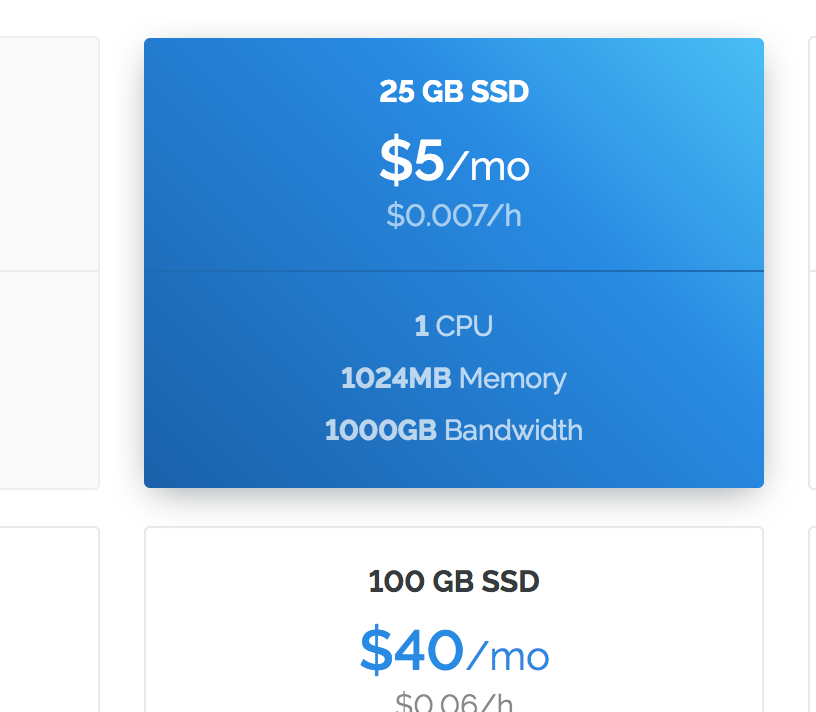

第五步：接着就是部署起来了，当然你也可以给服务器起个名字再部署


第六步：接着等待服务器启动完成，看到Status是绿色的Running就是启动完成了，这个过程大概需要1-3分钟。


第七步：复制IP地址和密码，后面有用

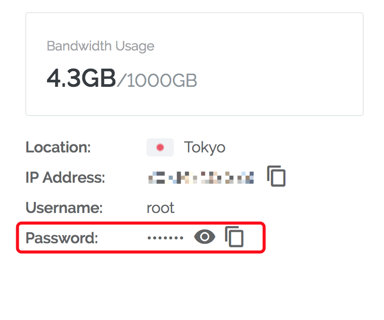

第八步：启动完成后，当然测试一下有没有被封掉IP了，打开命令管理器或者终端，输入 ping+你的IP地址，例如我服务器IP是8.8.8.8，则ping 8.8.8.8，如果出现下图的返回信息则这个IP是可以用的，偶尔一个request timeout也是可以的，是掉包现象，如果出现一直request timeout就把这服务器删掉重新部署吧。


好了，到此为止最困难的事情已经过去了，后面都是一键式的了，喝杯茶🍵再继续。

## 在服务器安装ss

因为我是用mac的，考虑到大多数人还是使用windows为主，我就把我的旧电脑给翻出来开机继续做教程。基于windows 7。

- **如果你是用mac，那恭喜你，下面连接的步骤直接打开终端输入**

`ssh root@你的服务器IP地址`

**连接就可以，然后可以跳过安装并运行xshell这个步骤**


- **如果你是用windows10,可以打开系统自带的powershell工具:**


**输入**

`ssh root@你的服务器IP地址`


**连接就可以，然后可以跳过安装并运行xshell这个步骤**

### 安装并运行xshell

**提示：如果服务器可以ping通，但xshell无法连接说明服务器被封端口了（很多vultr日本服务器有这种状况），请更换其他地区服务器或者更换服务器商**

windows下ssh连接需要下载Xshell，百度搜一搜就能下载了，当然你也可以用其他的，这里以Xshell为例，安装好Xshell后点击文件-新建

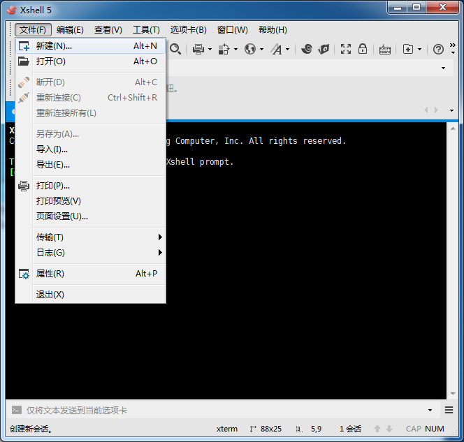

接下来配置连接,名称随便起，主机填写你的服务器IP地址，下面都默认就好

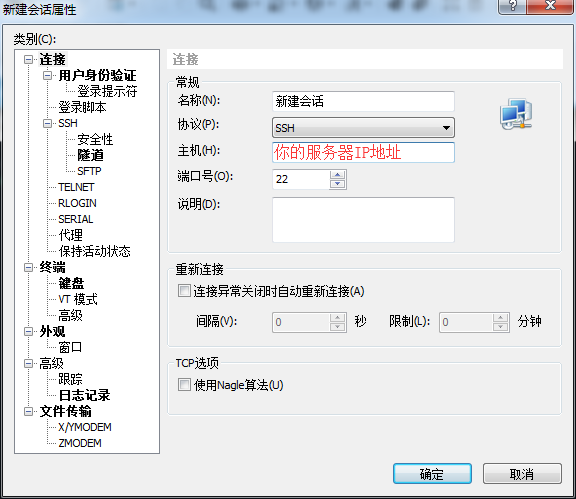

接下来在弹出的窗口填root（默认服务器用户名）


这里就要填入你在上篇复制的服务器密码了


### 安装ss

上面登录成功后如图所示


下面就是精髓的部分了，感谢[@teddysun](https://github.com/teddysun)大佬制作的一键安装脚本，具体更多细节可查看博客：https://teddysun.com/486.html  (由于大佬的[退出](https://teddysun.com/548.html),所以下面的命令目前还可以使用，但是版本已经不再更新)

```
wget --no-check-certificate -O shadowsocks-all.sh https://raw.githubusercontent.com/teddysun/shadowsocks_install/master/shadowsocks-all.sh
chmod +x shadowsocks-all.sh
./shadowsocks-all.sh 2>&1 | tee shadowsocks-all.log
```

复制粘贴上面代码到xshell，在xshell要右键粘贴，然后就会有一大串不知名代码蹦出，停在这里了


这时候按一下Enter回车键它又可以继续了～

接着又蹦出些东西，是让我们选择ss的服务器端，这里我选择go版本的，输入3按回车

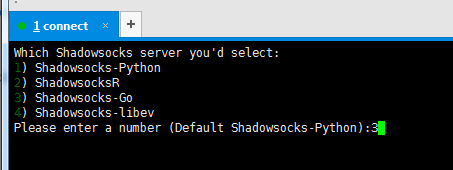

如同往常，接下来是要填入ss客户端登录的密码，这里我随意填：abc123456


接下来是输入端口号（1-65535任意数字），这里我填默认的


接下来是选择加密方式，默认就好，按回车

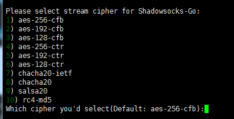

接着又是反手一个回车就好


这里可能需要等待一会，看到下图就是大功告成了。干杯🍻！

这个最好截图一下，以防忘记了。

我就当大家英文水平还好吧，下面说的就是你的服务器IP，服务器端端口，密码，加密方式。

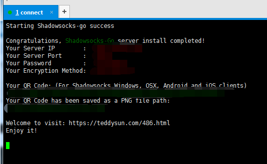

## 下载客户端

如果你跟着我到了这一步就代表安装好了服务器端，但是我们的电脑手机作为客户端也是需要安装客户端软件的。下面是各个终端的下载地址（我用过Windows,MAC,Android,IOS操作起来都是差不多的。）：

**注意：由于windows客户端最新版4.4.0.0取消了旧版加密方式支持，所以暂时需要先选择4.3.3.0版本的客户端**

Windows：https://github.com/shadowsocks/shadowsocks-windows/releases/tag/4.3.3.0

Android:https://github.com/shadowsocks/shadowsocks-android/releases

MAC:https://github.com/shadowsocks/ShadowsocksX-NG/releases

Linux:https://github.com/shadowsocks/shadowsocks-qt5/wiki/Installation

> **提示:**
>
> 如果github下载慢，可以试一下到我的网盘下载(部署在Vultr日本):
> https://download.chiuwaiho.tech/s/GJRmzjWDaPoj96Q

IOS: 

由于国区APP下架VPN类APP，包括支持ss类的APP，所以需要切换账号

建议注册一个国外账号，不要国内账号换区，这样既可以需要下载国内APP时切换国区账号，需要下载国外APP时切换外区账号。

**建议不想折腾的可以淘宝买一个国外App Store账号，便宜方便快捷**

步骤：

1.获取一个国区以外的账号

注册国外appid教程：https://www.zhihu.com/question/26458172

（相关注册外区账号教程很多，可以自行搜索）

**由于苹果的新政策，注册apple id在付款方式选择的时候非当地ip无法选择none选项，例如我注册英国区账号，需要ip为英国才可以。即在注册时要搭梯子，对应ip注册。**

2.在APPStore中切换为国区以外账号

3.在AppStore搜索**Potatso Lite**安装

注：或者其他支持shadowsocks的APP也可以，这里比较推荐Potatso Lite
- [Potatso Lite](https://itunes.apple.com/us/app/potatso-lite/id1239860606?mt=8)

  

**下面以windows为例演示：**

打开上方网址下载客户端：

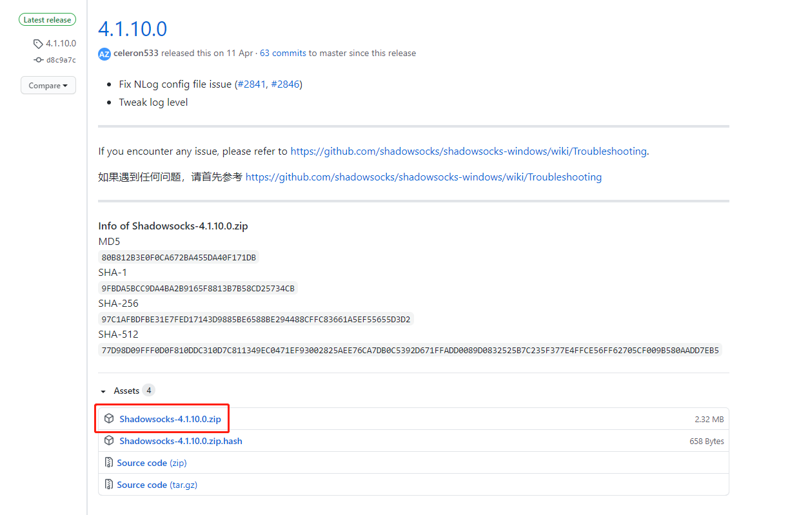

接着解压后打开Shadowsocks.exe，右击右下角小飞机，点击服务器-编辑服务器：

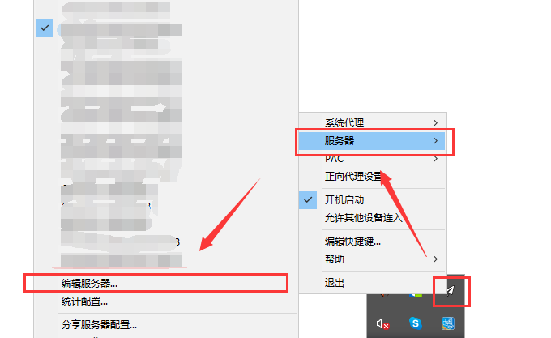

还记得上面建议保存的图片吗？这里就用到了，服务器IP，端口，密码，加密方式，然后点击确定

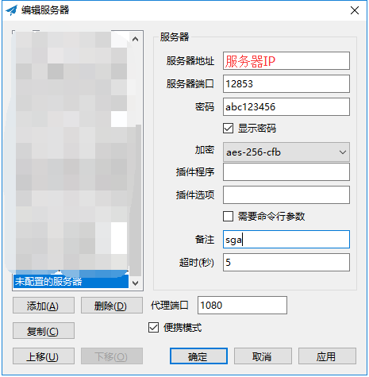


最后确保打开了PAC模式：

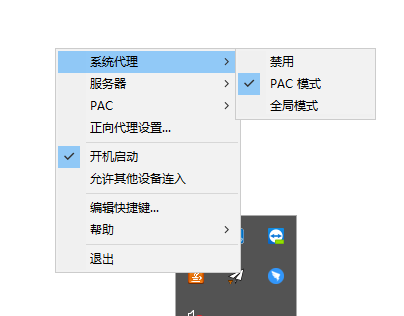


- 这里简要说一下PAC模式和全局模式问题：

PAC模式就是访问国内网站会走国内IP，访问被封的网站走服务器IP

全局就是全部走服务器IP

这里建议选择PAC模式，PAC的地址都是保存在[gfwlist](https://github.com/gfwlist/gfwlist)

希望大家遇到PAC无法访问的网站多上去提issues。

### 神圣时刻

接着最神圣的时刻来了，在浏览器输入google.com，回车，蹦，谷歌回来了


# 补充
## 设置多端口

[如何启用 Shadowsocks 的多端口](https://zhaoweihao.dev/2019/06/01/%E5%A6%82%E4%BD%95%E5%90%AF%E7%94%A8Shadowsocks%E7%9A%84%E5%A4%9A%E7%AB%AF%E5%8F%A3/)

## 常用命令
start 启动
stop 停止
restart 重启
status 状态
### Shadowsocks-libev 版：
``` bash
/etc/init.d/shadowsocks-libev start
/etc/init.d/shadowsocks-libev stop
/etc/init.d/shadowsocks-libev restart
/etc/init.d/shadowsocks-libev status
```

### Shadowsocks-Python 版：
``` bash
/etc/init.d/shadowsocks-python start
/etc/init.d/shadowsocks-python stop
/etc/init.d/shadowsocks-python restart
/etc/init.d/shadowsocks-python status
```

### ShadowsocksR 版：
``` bash
/etc/init.d/shadowsocks-r start
/etc/init.d/shadowsocks-r stop
/etc/init.d/shadowsocks-r restart
/etc/init.d/shadowsocks-r status
```

### Shadowsocks-Go 版：
``` bash
/etc/init.d/shadowsocks-go start
/etc/init.d/shadowsocks-go stop
/etc/init.d/shadowsocks-go restart
/etc/init.d/shadowsocks-go status
```

## 如何卸载
运行如下命令，根据提示，选择对应版本卸载
``` bash
./shadowsocks-all.sh uninstall
```
# 最后

最后，这里我们的任务完成了，但是如果你想优化一下服务器连接，可以安装BBR加速。具体可以看这篇文章：[文章](https://teddysun.com/489.html)

> 使用root用户登录，运行以下命令：
>
> ```bsh
> wget --no-check-certificate https://github.com/teddysun/across/raw/master/bbr.sh && chmod +x bbr.sh && ./bbr.sh
> ```
>
> 安装完成后，脚本会提示需要重启 VPS，输入 y 并回车后重启。

# 更新
## 201210更新
Tips：如果要使用国内的服务器(例如阿里云、腾讯云之类的)最好先[一键DD系统](https://ssr.tools/693)重装成纯净版系统再搭建Shadowsocks服务，否则可能会收到警告邮件

## 190615更新  
[#13](https://github.com/zhaoweih/Shadowsocks-Tutorial/issues/13)  

> 其他需要paypal的服务商，例如[digitalocean](https://m.do.co/c/6a45e437ae9f)、[hostus](https://hostus.us/)、[vpsserver](https://www.vpsserver.com/)。后面两的成功率很高，基本我开没有被封的，但是后面两不能随便销毁主机换ip的，且用珍惜吧。
>
> 或者试一下便宜的机场服务（如果不需要很稳定的话，机场服务线路多，而且快）：https://ssmgr.gyteng.com/home/ref/9354903935
>
> 😀
>

## 190601更新  
如果需要设置多端口，可以参考以下文章  
[如何启用 Shadowsocks 的多端口](https://zhaoweihao.dev/2019/06/01/%E5%A6%82%E4%BD%95%E5%90%AF%E7%94%A8Shadowsocks%E7%9A%84%E5%A4%9A%E7%AB%AF%E5%8F%A3/)

## 190519更新  
添加备用教程  
[给小白的超简单shadowsocks翻墙教程](./super_easy_shadowsocks_tutorial.md)

## 190518更新  
[增加AWS安装EPEL的说明 #8](https://github.com/zhaoweih/Shadowsocks-Tutorial/issues/8)

## 190505更新
如果只是需要临时使用，可以尝试免费的节点  
https://free1.gyteng.com/

## 190203更新
如果想要测试服务器的下载速度和运行速度，可以查看这篇文章:[文章](https://teddysun.com/444.html)
>仅需要一行命令
>```bsh
>wget -qO- bench.sh | bash
>```

我的一些服务器测试速度，希望对大家选择服务器时有用:
- digitalocean新加坡 5美金一个月
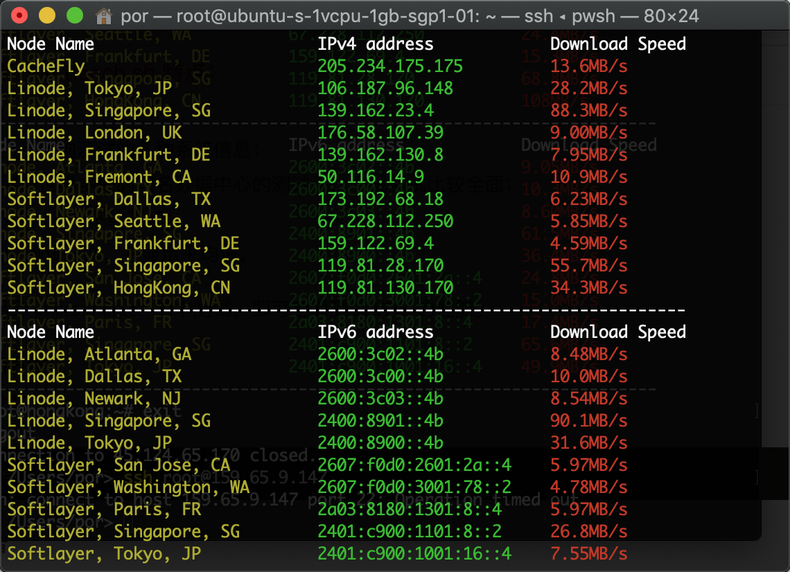
- vpsserver日本东京 4.9美金一个月
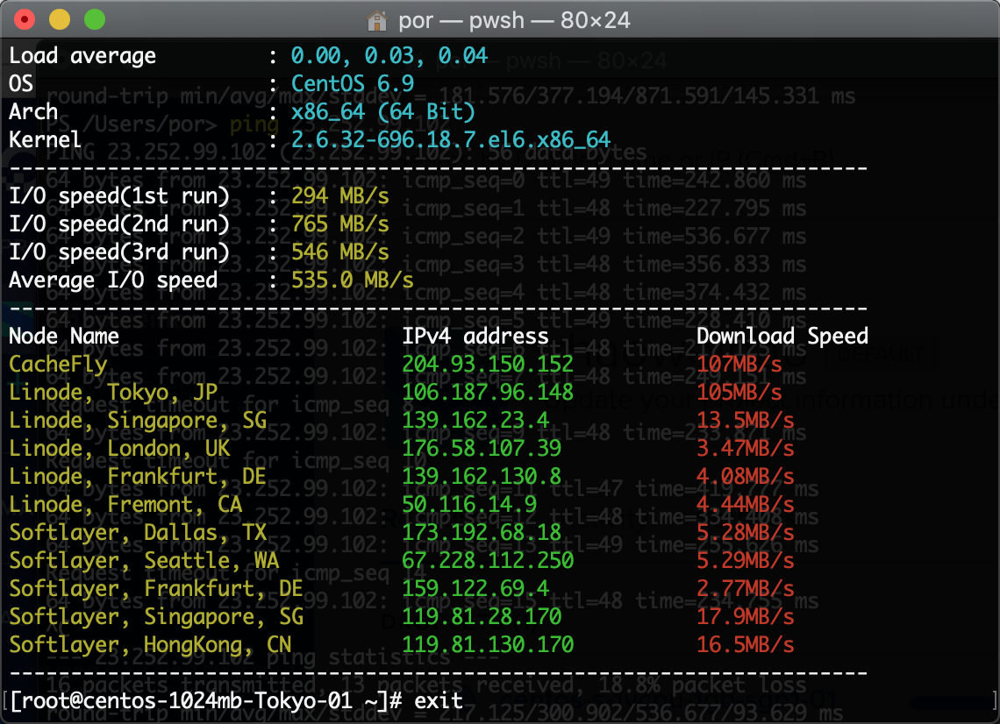
- hostus香港 2.95美金一个月
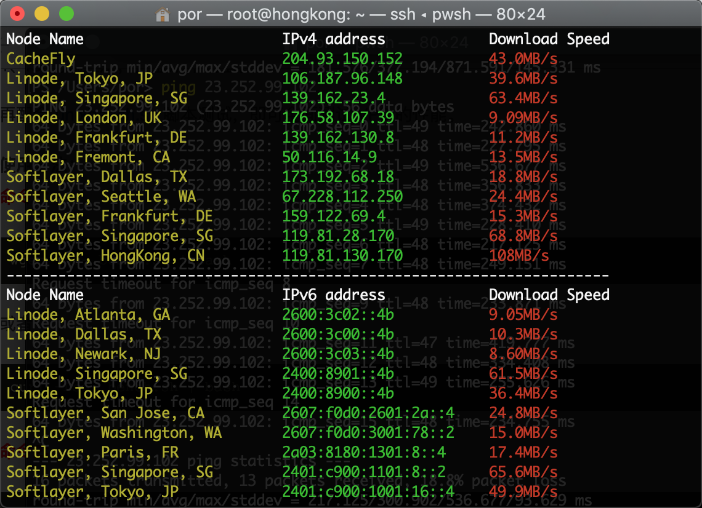
- aws亚马逊韩国 免费一年EC2
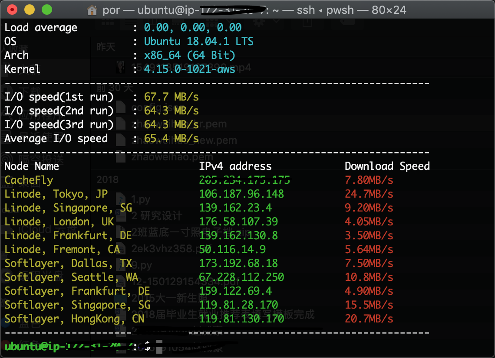

## 180624更新
如果要PAC自定义规则，即譬如你要上的网站不在PAC目录里，可以自己添加
譬如我要加github进入PAC自定义协议里
格式如下：

```
||github.com
```

添加进去后,**记得重启一下Shadowsocks让它生效**

api.github.com 

github.com/zhaoweih

等等包含github.com的URL都会走服务器IP

# Q&A
汇总一些邮件反馈的问题

**[已解决]1.问题：-bash: wget: command not found
环境：服务器：linode，新加坡服务器，cent os7**  

可以参照这篇文章安装wget后尝试：https://www.wn789.com/5624.html


**[已解决]2.问题:当访问Google学术时，会提示 : 
"We are sorry, but your computer or network may be sending automated queries. To protect our users, we can't process your request right now "**  

由于谷歌有自己的一套反代理爬虫的机制，所以很多 VPS 的 ip 会被谷歌检测到是代理，遇到这种情况可以用更换服务器即可，如果没有其他服务器可用，可以用[谷歌学术镜像](https://lai.yuweining.cn/archives/2112/)。

**[已解决]3.aws ec2报错Install EPEL repository failed的解决办法**  

参考文章：http://blog.openpilot.cc/archives/aws-ec2%E6%8A%A5%E9%94%99install-epel-repository-failed%E7%9A%84%E8%A7%A3%E5%86%B3%E5%8A%9E%E6%B3%95/

# 讨论
## Discussions
**创建了Github讨论区，欢迎小伙伴一起来讨论**
[Github Discussions](https://github.com/zhaoweih/Shadowsocks-Tutorial/discussions)

## Discord
**我创建了一个discord聊天室，遇到问题的小伙伴可以一起讨论**
[](https://discord.gg/wHFxCVk)

# 更多
**如果想详细了解有关shadowsocks翻墙知识的小伙伴可以查看下面文章**

- [浅谈vpn、vps、Proxy以及shadowsocks之间的联系和区别](https://medium.com/@thomas_summon/%E6%B5%85%E8%B0%88vpn-vps-proxy%E4%BB%A5%E5%8F%8Ashadowsocks%E4%B9%8B%E9%97%B4%E7%9A%84%E8%81%94%E7%B3%BB%E5%92%8C%E5%8C%BA%E5%88%AB-b0198f92db1b)

# 建议

如果大家对这篇文章有任何疑问都可以提[issues](https://github.com/zhaoweih/Shadowsocks-Tutorial/issues)，如果你有其他更简单或者其他方法翻墙也可以pull requests。

# 关于

我是一名初入社会的社畜，一个追求自由的少年，如果想要找我，可以给我发邮件📧

📮我的邮箱：zhaoweihao.dev@gmail.com

# 赞赏

我目前生活还是蛮自如的，有吃的有喝的，就不用赞赏了。喜欢就给我个star或者fork一下吧❤️，谢谢！
